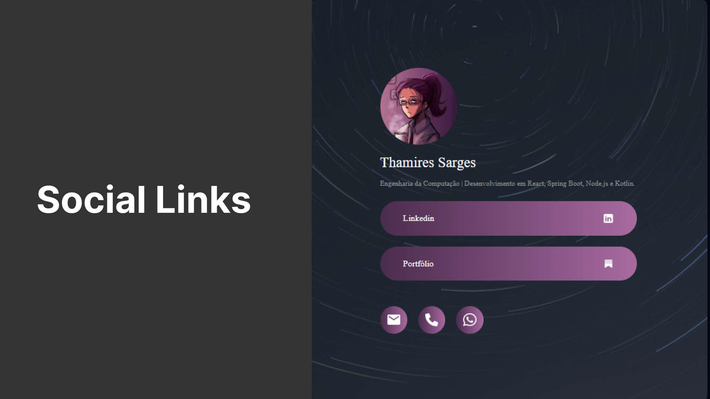

# 🌐 Social Links – Meu Hub Pessoal de Contatos  

Criei este projeto como uma forma prática e visual de centralizar meus principais links profissionais e de contato.  
A ideia foi desenvolver uma página simples, responsiva e elegante que funcione como um **cartão de visitas digital**.  

O projeto foi estruturado em **HTML e CSS**, priorizando um design limpo, com uso de gradientes, ícones e elementos visuais que destacam cada rede social ou forma de contato.  

## ✨ Funcionalidades  
- Foto de perfil e breve descrição profissional.  
- Links para **LinkedIn** e **portfólio**, com ícones personalizados.  
- Sessão de contato rápido com ícones de **e-mail, telefone e WhatsApp**.  
- Layout responsivo, garantindo boa experiência tanto em dispositivos móveis quanto em desktops.  

🌍 **Demonstração no GitHub Pages**: [https://thamiressarges.github.io/social-links]  

